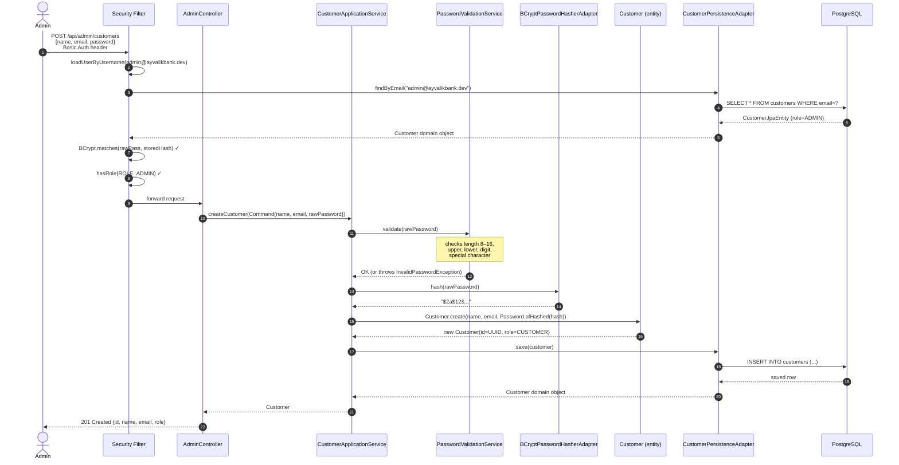
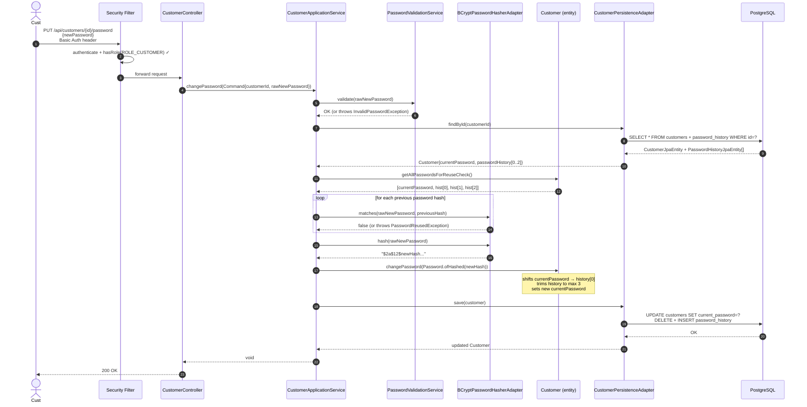
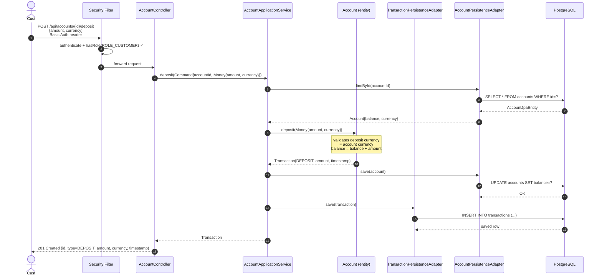
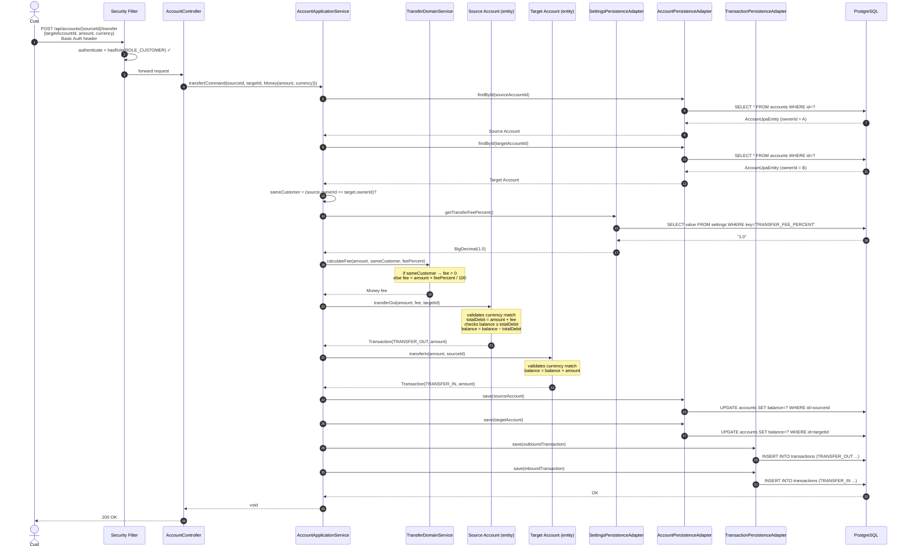
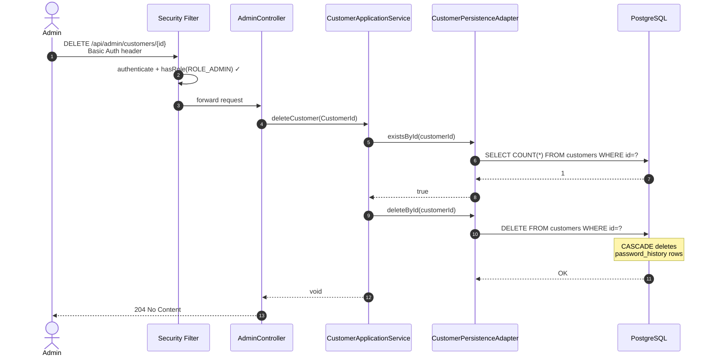
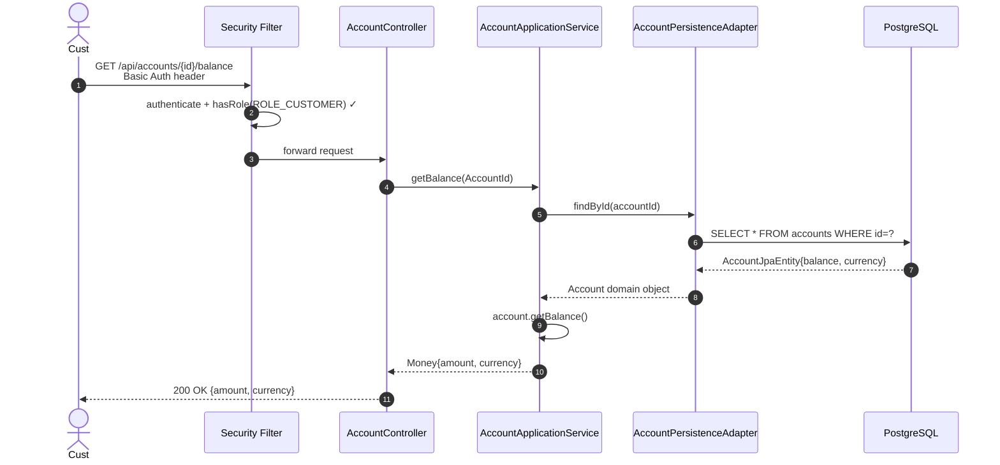
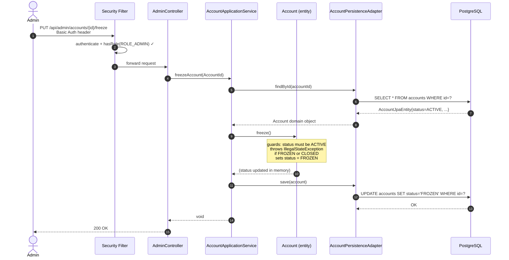

# Use Case Flow Diagrams — Ayvalık Bank CC-1

Each diagram shows the full call chain from the HTTP client through every architectural layer.

**Layer key:**

| Lane | Layer |
|------|-------|
| Actor | Human user (Admin / Customer) |
| Security | Spring Security filter chain |
| Controller | Inbound adapter (REST) |
| AppService | Application service (orchestration) |
| Domain | Entities and domain services (pure Java) |
| Persistence | Outbound adapter (JPA) |
| DB | PostgreSQL |

---

## 1. CreateCustomerUseCase

Admin creates a new customer with a validated, hashed password.

---

## 2. ChangePasswordUseCase

Customer changes their own password. New password must pass format rules and must not match the last 3 used passwords.

---

## 3. DepositMoneyUseCase

Customer deposits money into one of their accounts.

---

## 4. TransferMoneyUseCase

The most complex flow. Customer transfers money between accounts. Fee is 0% for same-customer transfers; admin-configured % for cross-customer transfers.

---

## 5. DeleteCustomerUseCase

Admin deletes an existing customer by ID.

---

## 6. GetBalanceUseCase

Customer queries the current balance of an account.

---

## 7. FreezeAccountUseCase

Admin freezes an account. The state transition lives entirely in the `Account` domain entity.

> **Unfreeze** (`PUT /api/admin/accounts/{id}/unfreeze`) follows the same flow with `account.unfreeze()`: requires `FROZEN`, sets `ACTIVE`.
>
> **Close** (`PUT /api/admin/accounts/{id}/close`) follows the same flow with `account.close()`: accepts `ACTIVE` or `FROZEN`, sets `CLOSED` (terminal — no further transitions possible).
